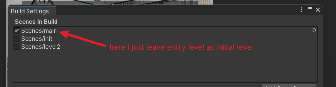

## What is Addressable

Addressable is a tool designed to manage assets more efficiently by allowing developers to load, unload, and manage asset references dynamically at runtime, with a focus on reducing memory usage and optimizing loading times.

It's an advance version of AssetBundle, it provides methods or load async, release, and it can locate AB packages automatically. Different with AssetBundle, addressable helps developers process dependencies automatically. Over all, addressable gives people advanced methods to process assets.

## How Addressable works

Addressable use logic address as its loader handle, so we don't need to care about the asset's real physical address. In addressable, "logical address" and "physical address" are separately, we can define logical address in custom, like:
```
logical address = "Player.prefab"
real address = "Assets/Resources/Prefab/Player.prefab"
```

When we check for an asset, and we can set logical address for it. we also can set group for assets, each group will be packed as a AB package. Addressable set packages location in three type: `Local`, `Remote`, `Built-In`
```
- 本地存储（Local）
  - StreamingAssets
  - 应用安装目录
- 远程服务器（Remote）
  - CDN
  - 自定义服务器
- 内置包（Built-in）
  - 打包在应用程序中
```

Config Group for Asset
```C#
// 通过 Groups 设置资源加载方式
public class AddressableConfig : MonoBehaviour
{
    void SetupGroups()
    {
        // 本地组
        var localGroup = AddressableAssetGroup.Create("LocalAssets");
        localGroup.BuildPath = "Library/LocalBundles";
        
        // 远程组
        var remoteGroup = AddressableAssetGroup.Create("RemoteAssets");
        remoteGroup.BuildPath = "ServerURL/RemoteBundles";
    }
}
```

Load Processing
```C#
public class ResourceLoader : MonoBehaviour
{
    async void LoadAsset()
    {
        try {
            // 1. 查找资源位置
            var locations = await Addressables.LoadResourceLocationsAsync("Player_001");
            
            // 2. 根据位置信息加载
            foreach (var location in locations)
            {
                // 自动处理本地/远程加载
                var asset = await Addressables.LoadAssetAsync<GameObject>(location);
                
                // 获取详细位置信息
                Debug.Log($"Loaded from: {location.PrimaryKey}");
                Debug.Log($"Provider: {location.ResourceType}");
                Debug.Log($"Path: {location.InternalId}");
            }
        }
        catch (Exception e) {
            Debug.LogError($"Load failed: {e.Message}");
        }
    }
}
```
**Tip:** one logical address can have multiply location, like different devices, and one asset can have multiple logical address.
```
// 同一个资源在不同平台的变体
"Player_001" -> {
    location1: "Assets/Player/PC/Player.prefab",
    location2: "Assets/Player/Mobile/Player.prefab"
}
```

## Ways of Loading Assets

```c#
// sync
var handle = Addressables.LoadAssetAsync<T>(address); return handle.WaitForCompletion();

// Async
var handle = Addressables.LoadAssetAsync<T>(address); 
await handle.Task; 
if (handle.Status == AsyncOperationStatus.Succeeded) 
{ return handle.Result; }

// load with label
var handle = Addressables.LoadAssetsAsync<T>(label, null); 
await handle.Task; 
if (handle.Status == AsyncOperationStatus.Succeeded) 
{ return handle.Result; }

// load by location
var locationsHandle = Addressables.LoadResourceLocationsAsync(key); await locationsHandle.Task;

// load scene
var handle = Addressables.LoadSceneAsync(address, mode); 
await handle.Task; 
return handle.Result;
```

## How to use Addressable

3. install Addressable package from package manager
4. choose the assets which you want to tag "addressable", I separated my bundle into two parts, one for the enter level, the rest for levels.
   In my game, there are 3 levels, "Entry", "Tutorial" and "Battle". The "Tutorial" level is small, so I make "Tutorial" and "Battle" as one package, the "Entry" as an independent package. Then separate the assets, and click the "addressable" checkbox for them. In the game, I tag all assets which used for "Tutorial" and "Battle" level. 
   
   
5. You can set `group` for assets, and you also can set `labels` for assets. `labels` can be used when you want to load assets dynamic.
6. When assets separation is finished, we can click `Build` to pack the game. 

## Use assets in Addressable

if we use Addressable, we can't use `Resources.Load<>()` anymore, we need to use `Addressables.LoadAssetAsync` API

Here are some examples:
```c#
// load assets
Addressables.LoadAssetAsync<GameObject>(bossPreAddress).Completed += OnAssetLoaded;

// load scene
Addressables.LoadSceneAsync(level, LoadSceneMode.Single).Completed += OnMainLevelLoaded;
```